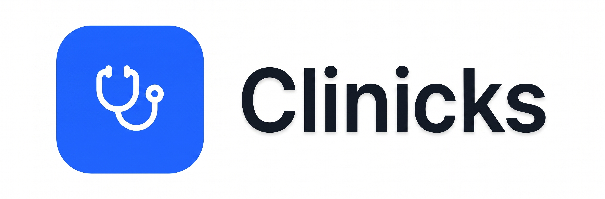

    

# Clinicks - Sistema de Gestión Hospitalaria

**Clinicks** es una plataforma integral de gestión hospitalaria diseñada para optimizar la operativa diaria en centros de salud. El sistema permite la centralización de historiales clínicos, el seguimiento de pacientes en tiempo real y la gestión eficiente de recursos hospitalarios, garantizando la trazabilidad de la información médica.

## Características Principales

* **Gestión de Pacientes:** Registro completo, edición y seguimiento de estados (internación, tratamiento, alta).
* **Historial Clínico Digital:** Registro cronológico de consultas, diagnósticos y procedimientos realizados.
* **Gestión de Hospitalización:** Control de disponibilidad de camas, asignación de habitaciones por pisos y traslados.
* **Seguridad y Roles:** Acceso restringido mediante autenticación JWT para médicos, enfermeros y administrativos.

## Stack Tecnológico

El sistema está construido bajo una arquitectura robusta y escalable:

* **Frontend:** [React](https://reactjs.org/) + [TypeScript](https://www.typescriptlang.org/) + [Tailwind CSS](https://tailwindcss.com/)
* **Backend:** [Java](https://www.java.com/) con [Spring Boot](https://spring.io/projects/spring-boot)
* **Persistencia:** [PostgreSQL](https://www.postgresql.org/)
* **Seguridad:** Spring Security + JSON Web Tokens (JWT)
* **Infraestructura:** Despliegue en Vercel (Front) y Supabase (Backend)

## Documentación del Proyecto
Puedes encontrar los detalles técnicos en la carpeta `/docs`:
* **ERD:** Modelo Entidad-Relación normalizado.
* **Diccionario de Datos:** Detalle de cada tabla y restricción del sistema.
* **Arquitectura:** Diagramas de flujo y estructura de red.

---

> [!NOTE]
> Este proyecto fue desarrollado como Trabajo de Campo para la cátedra de **Ingeniería de Software 2 (2026)** en la Licenciatura en Sistemas de Información - **UNNE**.

**Grupo Nº 43** Integrantes: *Zini, Samuel Nehuen* & *Orban, Tobias Naim*