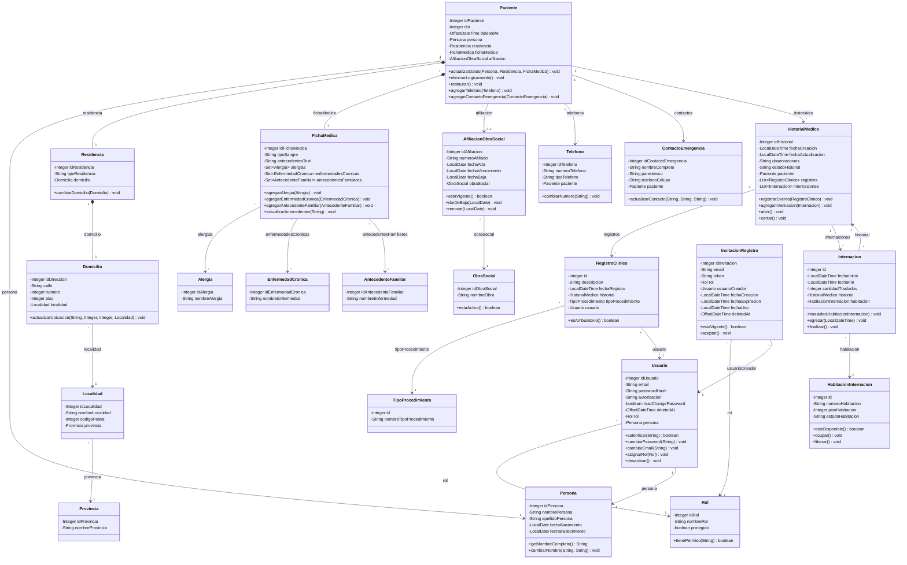

# Diagrama de clases lógico de Clinicks

## Qué representa este documento

Este documento explica el diagrama de clases lógico del sistema, donde cada clase resume un concepto de negocio y no una capa técnica. Aquí se describen:

- Los atributos que forman cada concepto.
- Los métodos del diagrama y el lugar del código donde se implementan.
- Las relaciones principales entre conceptos del dominio.

El diagrama fuente está en [diagrama de clases/diagrama-clases-logico.mermaid](diagrama%20de%20clases/diagrama-clases-logico.mermaid).

## Diagrama

## Cómo leerlo

Este diagrama muestra una sola clase por concepto de negocio. Las relaciones principales son:

- `Paciente` se apoya en `Persona`, `Residencia`, `FichaMedica` y `AfiliacionObraSocial`.
- `HistorialMedico` agrupa `RegistroClinico` e `Internacion`.
- `RegistroClinico` siempre pertenece a un `TipoProcedimiento` y a un `Usuario` que lo cargó.
- `InvitacionRegistro` vincula el alta de un usuario con `Rol` y `Usuario` creador.

## Mapeo de atributos y métodos al código

### Persona

- Atributos: `idPersona`, `nombrePersona`, `apellidoPersona`, `fechaNacimiento`, `fechaFallecimiento` → [../backend/src/main/java/com/clinicks/model/Persona.java#L20](../backend/src/main/java/com/clinicks/model/Persona.java#L20)
- `getNombreCompleto()` → [../backend/src/main/java/com/clinicks/service/impl/AuthServiceImpl.java#L188](../backend/src/main/java/com/clinicks/service/impl/AuthServiceImpl.java#L188), [../backend/src/main/java/com/clinicks/service/impl/AdminServiceImpl.java#L111](../backend/src/main/java/com/clinicks/service/impl/AdminServiceImpl.java#L111), [../backend/src/main/java/com/clinicks/service/impl/PacienteServiceImpl.java#L541](../backend/src/main/java/com/clinicks/service/impl/PacienteServiceImpl.java#L541)
- `cambiarNombre(String, String)` → [../backend/src/main/java/com/clinicks/service/impl/PerfilServiceImpl.java#L81](../backend/src/main/java/com/clinicks/service/impl/PerfilServiceImpl.java#L81), [../backend/src/main/java/com/clinicks/service/impl/PacienteServiceImpl.java#L188](../backend/src/main/java/com/clinicks/service/impl/PacienteServiceImpl.java#L188)

### Usuario

- Atributos: `idUsuario`, `email`, `pass`, `autorizacion`, `mustChangePassword`, `deletedAt`, `rol`, `persona` → [../backend/src/main/java/com/clinicks/model/Usuario.java#L20](../backend/src/main/java/com/clinicks/model/Usuario.java#L20)
- `autenticar(String)` → [../backend/src/main/java/com/clinicks/service/impl/AuthServiceImpl.java#L42](../backend/src/main/java/com/clinicks/service/impl/AuthServiceImpl.java#L42), [../backend/src/main/java/com/clinicks/repository/UsuarioRepository.java#L24](../backend/src/main/java/com/clinicks/repository/UsuarioRepository.java#L24)
- `cambiarPassword(String)` → [../backend/src/main/java/com/clinicks/service/impl/PerfilServiceImpl.java#L60](../backend/src/main/java/com/clinicks/service/impl/PerfilServiceImpl.java#L60)
- `cambiarEmail(String)` → [../backend/src/main/java/com/clinicks/service/impl/PerfilServiceImpl.java#L37](../backend/src/main/java/com/clinicks/service/impl/PerfilServiceImpl.java#L37)
- `asignarRol(Rol)` → [../backend/src/main/java/com/clinicks/service/impl/AdminServiceImpl.java#L41](../backend/src/main/java/com/clinicks/service/impl/AdminServiceImpl.java#L41)
- `desactivar()` → [../backend/src/main/java/com/clinicks/service/impl/AdminServiceImpl.java#L63](../backend/src/main/java/com/clinicks/service/impl/AdminServiceImpl.java#L63)

### Rol

- Atributos: `idRol`, `nombreRol` → [../backend/src/main/java/com/clinicks/model/Rol.java#L18](../backend/src/main/java/com/clinicks/model/Rol.java#L18)
- `tienePermiso(String)` → [../backend/src/main/java/com/clinicks/service/impl/AuthServiceImpl.java#L42](../backend/src/main/java/com/clinicks/service/impl/AuthServiceImpl.java#L42), [../backend/src/main/java/com/clinicks/service/impl/AdminServiceImpl.java#L41](../backend/src/main/java/com/clinicks/service/impl/AdminServiceImpl.java#L41)

### Paciente

- Atributos: `idPaciente`, `dni`, `deletedAt`, `persona`, `residencia`, `fichaMedica`, `afiliacion` → [../backend/src/main/java/com/clinicks/model/Paciente.java#L20](../backend/src/main/java/com/clinicks/model/Paciente.java#L20)
- `actualizarDatos(Persona, Residencia, FichaMedica)` → [../backend/src/main/java/com/clinicks/service/impl/PacienteServiceImpl.java#L188](../backend/src/main/java/com/clinicks/service/impl/PacienteServiceImpl.java#L188)
- `eliminarLogicamente()` → [../backend/src/main/java/com/clinicks/service/impl/PacienteServiceImpl.java#L256](../backend/src/main/java/com/clinicks/service/impl/PacienteServiceImpl.java#L256)
- `restaurar()` → [../backend/src/main/java/com/clinicks/service/impl/PacienteServiceImpl.java#L270](../backend/src/main/java/com/clinicks/service/impl/PacienteServiceImpl.java#L270)
- `agregarTelefono(Telefono)` → [../backend/src/main/java/com/clinicks/service/impl/PacienteServiceImpl.java#L422](../backend/src/main/java/com/clinicks/service/impl/PacienteServiceImpl.java#L422), [../backend/src/main/java/com/clinicks/repository/TelefonoRepository.java#L18](../backend/src/main/java/com/clinicks/repository/TelefonoRepository.java#L18)
- `agregarContactoEmergencia(ContactoEmergencia)` → [../backend/src/main/java/com/clinicks/service/impl/PacienteServiceImpl.java#L432](../backend/src/main/java/com/clinicks/service/impl/PacienteServiceImpl.java#L432), [../backend/src/main/java/com/clinicks/repository/ContactoEmergenciaRepository.java#L17](../backend/src/main/java/com/clinicks/repository/ContactoEmergenciaRepository.java#L17)

### Residencia

- Atributos: `idResidencia`, `tipoResidencia`, `domicilio` → [../backend/src/main/java/com/clinicks/model/Residencia.java#L18](../backend/src/main/java/com/clinicks/model/Residencia.java#L18)
- `cambiarDomicilio(Domicilio)` → [../backend/src/main/java/com/clinicks/service/impl/PacienteServiceImpl.java#L108](../backend/src/main/java/com/clinicks/service/impl/PacienteServiceImpl.java#L108), [../backend/src/main/java/com/clinicks/service/impl/PacienteServiceImpl.java#L188](../backend/src/main/java/com/clinicks/service/impl/PacienteServiceImpl.java#L188)

### Domicilio

- Atributos: `idDireccion`, `calle`, `numero`, `piso`, `localidad` → [../backend/src/main/java/com/clinicks/model/Domicilio.java#L18](../backend/src/main/java/com/clinicks/model/Domicilio.java#L18)
- `actualizarUbicacion(String, Integer, Integer, Localidad)` → [../backend/src/main/java/com/clinicks/service/impl/PacienteServiceImpl.java#L188](../backend/src/main/java/com/clinicks/service/impl/PacienteServiceImpl.java#L188)

### Localidad

- Atributos: `idLocalidad`, `nombreLocalidad`, `codigoPostal`, `provincia` → [../backend/src/main/java/com/clinicks/model/Localidad.java#L18](../backend/src/main/java/com/clinicks/model/Localidad.java#L18)

### Provincia

- Atributos: `idProvincia`, `nombreProvincia` → [../backend/src/main/java/com/clinicks/model/Provincia.java#L18](../backend/src/main/java/com/clinicks/model/Provincia.java#L18)

### ObraSocial

- Atributos: `idObraSocial`, `nombreObra` → [../backend/src/main/java/com/clinicks/model/ObraSocial.java#L18](../backend/src/main/java/com/clinicks/model/ObraSocial.java#L18)
- `estaActiva()` → [../backend/src/main/java/com/clinicks/service/impl/PacienteServiceImpl.java#L384](../backend/src/main/java/com/clinicks/service/impl/PacienteServiceImpl.java#L384)

### AfiliacionObraSocial

- Atributos: `idAfiliacion`, `numeroAfiliado`, `fechaAlta`, `fechaVencimiento`, `fechaBaja`, `obraSocial` → [../backend/src/main/java/com/clinicks/model/AfiliacionObraSocial.java#L20](../backend/src/main/java/com/clinicks/model/AfiliacionObraSocial.java#L20)
- `estaVigente()` → [../backend/src/main/java/com/clinicks/service/impl/PacienteServiceImpl.java#L384](../backend/src/main/java/com/clinicks/service/impl/PacienteServiceImpl.java#L384)
- `darDeBaja(LocalDate)` → [../backend/src/main/java/com/clinicks/service/impl/PacienteServiceImpl.java#L384](../backend/src/main/java/com/clinicks/service/impl/PacienteServiceImpl.java#L384)
- `renovar(LocalDate)` → [../backend/src/main/java/com/clinicks/service/impl/PacienteServiceImpl.java#L384](../backend/src/main/java/com/clinicks/service/impl/PacienteServiceImpl.java#L384)

### FichaMedica

- Atributos: `idFichaMedica`, `tipoSangre`, `antecedentesText`, `alergias`, `enfermedadesCronicas`, `antecedentesFamiliares` → [../backend/src/main/java/com/clinicks/model/FichaMedica.java#L21](../backend/src/main/java/com/clinicks/model/FichaMedica.java#L21)
- `agregarAlergia(Alergia)` → [../backend/src/main/java/com/clinicks/service/impl/PacienteServiceImpl.java#L341](../backend/src/main/java/com/clinicks/service/impl/PacienteServiceImpl.java#L341)
- `agregarEnfermedadCronica(EnfermedadCronica)` → [../backend/src/main/java/com/clinicks/service/impl/PacienteServiceImpl.java#L353](../backend/src/main/java/com/clinicks/service/impl/PacienteServiceImpl.java#L353)
- `agregarAntecedenteFamiliar(AntecedenteFamiliar)` → [../backend/src/main/java/com/clinicks/service/impl/PacienteServiceImpl.java#L365](../backend/src/main/java/com/clinicks/service/impl/PacienteServiceImpl.java#L365)
- `actualizarAntecedentes(String)` → [../backend/src/main/java/com/clinicks/service/impl/PacienteServiceImpl.java#L188](../backend/src/main/java/com/clinicks/service/impl/PacienteServiceImpl.java#L188)

### Alergia / EnfermedadCronica / AntecedenteFamiliar

- Atributos de cada una: identificador y nombre → [../backend/src/main/java/com/clinicks/model/Alergia.java#L18](../backend/src/main/java/com/clinicks/model/Alergia.java#L18), [../backend/src/main/java/com/clinicks/model/EnfermedadCronica.java#L18](../backend/src/main/java/com/clinicks/model/EnfermedadCronica.java#L18), [../backend/src/main/java/com/clinicks/model/AntecedenteFamiliar.java#L18](../backend/src/main/java/com/clinicks/model/AntecedenteFamiliar.java#L18)

### Telefono

- Atributos: `idTelefono`, `numeroTelefono`, `tipoTelefono`, `paciente` → [../backend/src/main/java/com/clinicks/model/Telefono.java#L18](../backend/src/main/java/com/clinicks/model/Telefono.java#L18)
- `cambiarNumero(String)` → [../backend/src/main/java/com/clinicks/service/impl/PacienteServiceImpl.java#L422](../backend/src/main/java/com/clinicks/service/impl/PacienteServiceImpl.java#L422)

### ContactoEmergencia

- Atributos: `idContactoEmergencia`, `nombreCompleto`, `parentesco`, `telefonoCelular`, `paciente` → [../backend/src/main/java/com/clinicks/model/ContactoEmergencia.java#L18](../backend/src/main/java/com/clinicks/model/ContactoEmergencia.java#L18)
- `actualizarContacto(String, String, String)` → [../backend/src/main/java/com/clinicks/service/impl/PacienteServiceImpl.java#L432](../backend/src/main/java/com/clinicks/service/impl/PacienteServiceImpl.java#L432)

### HistorialMedico

- Atributos: `idHistorial`, `fechaCreacion`, `fechaActualizacion`, `observaciones`, `estadoHistorial`, `paciente`, `registros`, `internaciones` → [../backend/src/main/java/com/clinicks/model/HistorialMedico.java#L20](../backend/src/main/java/com/clinicks/model/HistorialMedico.java#L20)
- `registrarEvento(RegistroClinico)` → [../backend/src/main/java/com/clinicks/service/impl/HistorialServiceImpl.java#L119](../backend/src/main/java/com/clinicks/service/impl/HistorialServiceImpl.java#L119), [../backend/src/main/java/com/clinicks/service/impl/PacienteServiceImpl.java#L447](../backend/src/main/java/com/clinicks/service/impl/PacienteServiceImpl.java#L447), [../backend/src/main/java/com/clinicks/service/impl/HabitacionServiceImpl.java#L147](../backend/src/main/java/com/clinicks/service/impl/HabitacionServiceImpl.java#L147)
- `agregarInternacion(Internacion)` → [../backend/src/main/java/com/clinicks/service/impl/HabitacionServiceImpl.java#L39](../backend/src/main/java/com/clinicks/service/impl/HabitacionServiceImpl.java#L39)
- `abrir()` / `cerrar()` → [../backend/src/main/java/com/clinicks/service/impl/PacienteServiceImpl.java#L108](../backend/src/main/java/com/clinicks/service/impl/PacienteServiceImpl.java#L108), [../backend/src/main/java/com/clinicks/service/impl/HistorialServiceImpl.java#L36](../backend/src/main/java/com/clinicks/service/impl/HistorialServiceImpl.java#L36)

### TipoProcedimiento

- Atributos: `id`, `nombreTipoProcedimiento` → [../backend/src/main/java/com/clinicks/model/TipoProcedimiento.java#L18](../backend/src/main/java/com/clinicks/model/TipoProcedimiento.java#L18)

### RegistroClinico

- Atributos: `id`, `descripcion`, `fechaRegistro`, `historial`, `tipoProcedimiento`, `usuario` → [../backend/src/main/java/com/clinicks/model/RegistroClinico.java#L20](../backend/src/main/java/com/clinicks/model/RegistroClinico.java#L20)
- `esAmbulatorio()` → [../backend/src/main/java/com/clinicks/service/impl/HistorialServiceImpl.java#L36](../backend/src/main/java/com/clinicks/service/impl/HistorialServiceImpl.java#L36)

### Internacion

- Atributos: `id`, `fechaInicio`, `fechaFin`, `cantidadTraslados`, `historial`, `habitacion` → [../backend/src/main/java/com/clinicks/model/Internacion.java#L20](../backend/src/main/java/com/clinicks/model/Internacion.java#L20)
- `trasladar(HabitacionInternacion)` → [../backend/src/main/java/com/clinicks/service/impl/HabitacionServiceImpl.java#L78](../backend/src/main/java/com/clinicks/service/impl/HabitacionServiceImpl.java#L78)
- `egresar(LocalDateTime)` → [../backend/src/main/java/com/clinicks/service/impl/HabitacionServiceImpl.java#L109](../backend/src/main/java/com/clinicks/service/impl/HabitacionServiceImpl.java#L109)
- `finalizar()` → [../backend/src/main/java/com/clinicks/service/impl/HabitacionServiceImpl.java#L109](../backend/src/main/java/com/clinicks/service/impl/HabitacionServiceImpl.java#L109)

### HabitacionInternacion

- Atributos: `id`, `numeroHabitacion`, `pisoHabitacion`, `estadoHabitacion` → [../backend/src/main/java/com/clinicks/model/HabitacionInternacion.java#L18](../backend/src/main/java/com/clinicks/model/HabitacionInternacion.java#L18)
- `estaDisponible()` / `ocupar()` / `liberar()` → [../backend/src/main/java/com/clinicks/service/impl/HabitacionServiceImpl.java#L134](../backend/src/main/java/com/clinicks/service/impl/HabitacionServiceImpl.java#L134), [../backend/src/main/java/com/clinicks/service/impl/HabitacionServiceImpl.java#L39](../backend/src/main/java/com/clinicks/service/impl/HabitacionServiceImpl.java#L39), [../backend/src/main/java/com/clinicks/service/impl/HabitacionServiceImpl.java#L109](../backend/src/main/java/com/clinicks/service/impl/HabitacionServiceImpl.java#L109)

### InvitacionRegistro

- Atributos: `idInvitacion`, `email`, `token`, `rol`, `usuarioCreador`, `fechaCreacion`, `fechaExpiracion`, `fechaUso`, `deletedAt` → [../backend/src/main/java/com/clinicks/model/InvitacionRegistro.java#L21](../backend/src/main/java/com/clinicks/model/InvitacionRegistro.java#L21)
- `estaVigente()` → [../backend/src/main/java/com/clinicks/service/impl/AuthServiceImpl.java#L166](../backend/src/main/java/com/clinicks/service/impl/AuthServiceImpl.java#L166)
- `aceptar()` → [../backend/src/main/java/com/clinicks/service/impl/AuthServiceImpl.java#L64](../backend/src/main/java/com/clinicks/service/impl/AuthServiceImpl.java#L64)

## Nota final

El documento describe el modelo lógico del negocio y enlaza cada concepto con el código real donde se define o se ejecuta. Los enlaces con `#L...` abren el archivo en la línea de la declaración o de la implementación principal.
