# Diagrama de clases lógico de Clinicks

## Qué representa este documento

Este documento explica el diagrama de clases lógico del sistema, donde cada clase resume un concepto de negocio y no una capa técnica. Aquí se describen:

- Los atributos que forman cada concepto.
- Los métodos del diagrama y el lugar del código donde se implementan.
- Las relaciones principales entre conceptos del dominio.

El diagrama fuente está en [diagrama de clases/diagrama-clases.mermaid](diagrama%20de%20clases/diagrama-clases.mermaid).

## Diagrama

```mermaid
classDiagram
direction TB


class Persona {
  - String nombrePersona
  - String apellidoPersona
  - LocalDate fechaNacimiento
  - LocalDate fechaFallecimiento
  - getNombreCompleto(u : Usuario) String
  + cambiarNombre(nombre : String, apellido : String) void
}

class Usuario {
  - String email
  - String passwordHash
  - String autorizacion
  - boolean mustChangePassword
  - OffsetDateTime deletedAt
  - Rol rol
  - Persona persona
  + registrar(request : RegisterRequestDTO) LoginResponseDTO
  + autenticar(request : LoginRequestDTO) LoginResponseDTO
  + cambiarPassword(email : String, request : CambiarPasswordRequestDTO) PerfilResponseDTO
  + cambiarEmail(emailActual : String, request : CambiarEmailRequestDTO) PerfilResponseDTO
}

class Administrador  {
  <<rol>>
  - cambiarRol(idUsuario : Integer, request : CambiarRolRequestDTO) AdminUsuarioDTO
  + desactivarUsuario(idUsuario : Integer, emailSolicitante : String) AdminUsuarioDTO
  + activarUsuario(idUsuario : Integer) AdminUsuarioDTO
  + resetearPassword(idUsuario : Integer) ResetPasswordResponseDTO
}

class Rol {
  - String nombreRol
  - boolean protegido
  + tienePermiso(permiso : String) boolean
}

class Paciente {
  - Integer dni
  - OffsetDateTime deletedAt
  - Persona persona
  - Residencia residencia
  - FichaMedica fichaMedica
  - AfiliacionObraSocial afiliacion
  + actualizarDatos(idPaciente : Integer, dto : PacienteRequestDTO) PacienteResponseDTO
  + eliminarLogicamente(idPaciente : Integer) void
  + restaurarPaciente(idPaciente : Integer) void
  - agregarTelefono(paciente : Paciente, numero : String, tipo : String) void
  - agregarContactoEmergencia(paciente : Paciente, contactos : List<ContactoEmergencia>) void
}

class Residencia {
  - String tipoResidencia
  - Domicilio domicilio
  + cambiarDomicilio(idPaciente : Integer, dto : PacienteRequestDTO) Residencia
}

class Domicilio {
  - String calle
  - Integer numero
  - Integer piso
  - Localidad localidad
  + actualizarUbicacion(idPaciente : Integer, dto : PacienteRequestDTO) Domicilio
}

class Localidad {
  - String nombreLocalidad
  - Integer codigoPostal
  - Provincia provincia
  + actualizarLocalidad(idPaciente : Integer, dto : PacienteRequestDTO) Localidad
}

class Provincia {
  - String nombreProvincia
}

class ObraSocial {
  - String nombreObra
  - estaActiva(dto : PacienteRequestDTO) boolean
}

class AfiliacionObraSocial {
  - String numeroAfiliado
  - LocalDate fechaAlta
  - LocalDate fechaVencimiento
  - LocalDate fechaBaja
  - ObraSocial obraSocial
  - estaVigente(dto : PacienteRequestDTO) boolean
  - darDeBaja(dto : PacienteRequestDTO) void
  - renovar(dto : PacienteRequestDTO) AfiliacionObraSocial
}

class FichaMedica {
  - String tipoSangre
  - String antecedentesText
  - Set<Alergia> alergias
  - Set<EnfermedadCronica> enfermedadesCronicas
  - Set<AntecedenteFamiliar> antecedentesFamiliares
  - agregarAlergia(ficha : FichaMedica, nombres : List<String>) void
  - agregarEnfermedadCronica(ficha : FichaMedica, nombres : List<String>) void
  - agregarAntecedenteFamiliar(ficha : FichaMedica, nombres : List<String>) void
  + actualizarAntecedentes(idPaciente : Integer, dto : PacienteRequestDTO) PacienteResponseDTO
}

class Alergia {
  - String nombreAlergia
}

class EnfermedadCronica {
  - String nombreEnfermedad
}

class AntecedenteFamiliar {
  - String nombreEnfermedad
}

class Telefono {
  - String numeroTelefono
  - String tipoTelefono
  - Paciente paciente
  - cambiarNumero(paciente : Paciente, numero : String, tipo : String) void
  - normalizarTelefono(telefono : String) String
}

class ContactoEmergencia {
  - String nombreCompleto
  - String parentesco
  - String telefonoCelular
  - Paciente paciente
  - actualizarContacto(paciente : Paciente, contactos : List<ContactoEmergencia>) void
}

class HistorialMedico {
  - LocalDateTime fechaCreacion
  - LocalDateTime fechaActualizacion
  - String observaciones
  - String estadoHistorial
  - Paciente paciente
  - List<RegistroClinico> registros
  - List<Internacion> internaciones
  + registrarEvento(idPaciente : Integer, dto : RegistroClinicoRequestDTO, idUsuario : Integer) void
  + agregarInternacion(idHabitacion : Integer, dto : InternacionRequestDTO, idUsuario : Integer) void
  + abrir(idPaciente : Integer) void
  - cerrar(idPaciente : Integer) void
}

class TipoProcedimiento {
  - String nombreTipoProcedimiento
}

class RegistroClinico {
  - String descripcion
  - LocalDateTime fechaRegistro
  - HistorialMedico historial
  - TipoProcedimiento tipoProcedimiento
  - Usuario usuario
  + esAmbulatorio(idPaciente : Integer) boolean
}

class Internacion {
  - LocalDateTime fechaInicio
  - LocalDateTime fechaFin
  - Integer cantidadTraslados
  - HistorialMedico historial
  - HabitacionInternacion habitacion
  + trasladar(idInternacion : Integer, dto : TrasladoRequestDTO, idUsuario : Integer) void
  + egresar(idInternacion : Integer, dto : EgresoRequestDTO, idUsuario : Integer) void
  - finalizar(dto : EgresoRequestDTO) String
}

class HabitacionInternacion {
  - String numeroHabitacion
  - Integer pisoHabitacion
  - String estadoHabitacion
  - estaDisponible(idHabitacion : Integer) boolean
  - ocupar(idHabitacion : Integer, nuevoEstado : String) void
  + liberar(idHabitacion : Integer, nuevoEstado : String) void
}

class InvitacionRegistro {
  - String email
  - String token
  - Rol rol
  - Usuario usuarioCreador
  - LocalDateTime fechaCreacion
  - LocalDateTime fechaExpiracion
  - LocalDateTime fechaUso
  - OffsetDateTime deletedAt
  + estaVigente(token : String) boolean
  + aceptar(token : String) LoginResponseDTO
}


Usuario "*" --> "1" Rol : rol
Usuario "1" --> "1" Persona : persona
Usuario "1" --> "0..1" Administrador : administrador
Paciente "1" --> "1" Persona : persona
Paciente "1" *-- "1" Residencia : residencia
Paciente "1" *-- "1" FichaMedica : fichaMedica
Paciente "*" --> "0..1" AfiliacionObraSocial : afiliacion
Paciente "1" --> "*" Telefono : telefonos
Paciente "1" --> "*" ContactoEmergencia : contactos
Paciente "1" --> "*" HistorialMedico : historiales
Residencia "1" *-- "1" Domicilio : domicilio
Domicilio "*" --> "1" Localidad : localidad
Localidad "*" --> "1" Provincia : provincia
AfiliacionObraSocial "*" --> "1" ObraSocial : obraSocial
FichaMedica "*" --> "*" Alergia : alergias
FichaMedica "*" --> "*" EnfermedadCronica : enfermedadesCronicas
FichaMedica "*" --> "*" AntecedenteFamiliar : antecedentesFamiliares
HistorialMedico "1" --> "*" RegistroClinico : registros
HistorialMedico "1" --> "*" Internacion : internaciones
RegistroClinico "*" --> "1" TipoProcedimiento : tipoProcedimiento
RegistroClinico "*" --> "1" Usuario : usuario
Internacion "*" --> "1" HabitacionInternacion : habitacion
Internacion "*" --> "1" HistorialMedico : historial
InvitacionRegistro "*" --> "1" Rol : rol
InvitacionRegistro "*" --> "1" Usuario : usuarioCreador
```

## Cómo leerlo

Este diagrama muestra una sola clase por concepto de negocio. Las relaciones principales son:

- `Paciente` se apoya en `Persona`, `Residencia`, `FichaMedica` y `AfiliacionObraSocial`.
- `HistorialMedico` agrupa `RegistroClinico` e `Internacion`.
- `RegistroClinico` siempre pertenece a un `TipoProcedimiento` y a un `Usuario` que lo cargó.
- `InvitacionRegistro` vincula el alta de un usuario con `Rol` y `Usuario` creador.

## Mapeo de atributos y métodos al código

### Persona

- Atributos: `nombrePersona`, `apellidoPersona`, `fechaNacimiento`, `fechaFallecimiento` → [../backend/src/main/java/com/clinicks/model/Persona.java#L20](../backend/src/main/java/com/clinicks/model/Persona.java#L20)
- `getNombreCompleto(u : Usuario)` → [../backend/src/main/java/com/clinicks/service/impl/AuthServiceImpl.java#L197](../backend/src/main/java/com/clinicks/service/impl/AuthServiceImpl.java#L197), [../backend/src/main/java/com/clinicks/service/impl/AdminServiceImpl.java#L120](../backend/src/main/java/com/clinicks/service/impl/AdminServiceImpl.java#L120), [../backend/src/main/java/com/clinicks/service/impl/PacienteServiceImpl.java#L545](../backend/src/main/java/com/clinicks/service/impl/PacienteServiceImpl.java#L545)
- `cambiarNombre(String, String)` → [../backend/src/main/java/com/clinicks/service/impl/PerfilServiceImpl.java#L81](../backend/src/main/java/com/clinicks/service/impl/PerfilServiceImpl.java#L81), [../backend/src/main/java/com/clinicks/service/impl/PacienteServiceImpl.java#L188](../backend/src/main/java/com/clinicks/service/impl/PacienteServiceImpl.java#L188)

### Usuario

- Atributos: `email`, `pass`, `autorizacion`, `mustChangePassword`, `deletedAt`, `rol`, `persona` → [../backend/src/main/java/com/clinicks/model/Usuario.java#L20](../backend/src/main/java/com/clinicks/model/Usuario.java#L20)
- `registrar(request : RegisterRequest)` → [../backend/src/main/java/com/clinicks/service/impl/AuthServiceImpl.java#L64](../backend/src/main/java/com/clinicks/service/impl/AuthServiceImpl.java#L64)
- `autenticar(request : LoginRequest)` → [../backend/src/main/java/com/clinicks/service/impl/AuthServiceImpl.java#L42](../backend/src/main/java/com/clinicks/service/impl/AuthServiceImpl.java#L42), [../backend/src/main/java/com/clinicks/repository/UsuarioRepository.java#L24](../backend/src/main/java/com/clinicks/repository/UsuarioRepository.java#L24)
- `cambiarPassword(email : String, request : CambiarPasswordRequest)` → [../backend/src/main/java/com/clinicks/service/impl/PerfilServiceImpl.java#L60](../backend/src/main/java/com/clinicks/service/impl/PerfilServiceImpl.java#L60), [../backend/src/main/java/com/clinicks/service/impl/AdminServiceImpl.java#L91](../backend/src/main/java/com/clinicks/service/impl/AdminServiceImpl.java#L91)
- `cambiarEmail(emailActual : String, request : CambiarEmailRequest)` → [../backend/src/main/java/com/clinicks/service/impl/PerfilServiceImpl.java#L37](../backend/src/main/java/com/clinicks/service/impl/PerfilServiceImpl.java#L37)

### Administrador

- `cambiarRol(idUsuario : Integer, request : CambiarRolRequestDTO)` → [../backend/src/main/java/com/clinicks/service/impl/AdminServiceImpl.java#L26](../backend/src/main/java/com/clinicks/service/impl/AdminServiceImpl.java#L26)
- `desactivarUsuario(idUsuario : Integer, emailSolicitante : String)` → [../backend/src/main/java/com/clinicks/service/impl/AdminServiceImpl.java#L63](../backend/src/main/java/com/clinicks/service/impl/AdminServiceImpl.java#L63)
- `activarUsuario(idUsuario : Integer)` → [../backend/src/main/java/com/clinicks/service/impl/AdminServiceImpl.java#L79](../backend/src/main/java/com/clinicks/service/impl/AdminServiceImpl.java#L79)
- `resetearPassword(idUsuario : Integer)` → [../backend/src/main/java/com/clinicks/service/impl/AdminServiceImpl.java#L91](../backend/src/main/java/com/clinicks/service/impl/AdminServiceImpl.java#L91)

### Rol

- Atributos: `nombreRol` → [../backend/src/main/java/com/clinicks/model/Rol.java#L18](../backend/src/main/java/com/clinicks/model/Rol.java#L18)
- `tienePermiso(String)` → [../backend/src/main/java/com/clinicks/service/impl/AuthServiceImpl.java#L56](../backend/src/main/java/com/clinicks/service/impl/AuthServiceImpl.java#L56), [../backend/src/main/java/com/clinicks/service/impl/AdminServiceImpl.java#L52](../backend/src/main/java/com/clinicks/service/impl/AdminServiceImpl.java#L52)

### Paciente

- Atributos: `dni`, `deletedAt`, `persona`, `residencia`, `fichaMedica`, `afiliacion` → [../backend/src/main/java/com/clinicks/model/Paciente.java#L20](../backend/src/main/java/com/clinicks/model/Paciente.java#L20)
- `actualizarDatos(idPaciente : Integer , dto : PacienteRequest)` → [../backend/src/main/java/com/clinicks/service/impl/PacienteServiceImpl.java#L188](../backend/src/main/java/com/clinicks/service/impl/PacienteServiceImpl.java#L188)
- `eliminarLogicamente(idPaciente : Integer)` → [../backend/src/main/java/com/clinicks/service/impl/PacienteServiceImpl.java#L256](../backend/src/main/java/com/clinicks/service/impl/PacienteServiceImpl.java#L256)
- `restaurarPaciente(idPaciente : Integer)` → [../backend/src/main/java/com/clinicks/service/impl/PacienteServiceImpl.java#L270](../backend/src/main/java/com/clinicks/service/impl/PacienteServiceImpl.java#L270)
- `agregarTelefono(paciente : Paciente, numero : String, tipo : String)` → [../backend/src/main/java/com/clinicks/service/impl/PacienteServiceImpl.java#L454](../backend/src/main/java/com/clinicks/service/impl/PacienteServiceImpl.java#L454), [../backend/src/main/java/com/clinicks/repository/TelefonoRepository.java#L18](../backend/src/main/java/com/clinicks/repository/TelefonoRepository.java#L18)
- `agregarContactoEmergencia(paciente : Paciente, contactos : List<ContactoEmergencia>)` → [../backend/src/main/java/com/clinicks/service/impl/PacienteServiceImpl.java#L464](../backend/src/main/java/com/clinicks/service/impl/PacienteServiceImpl.java#L464), [../backend/src/main/java/com/clinicks/repository/ContactoEmergenciaRepository.java#L17](../backend/src/main/java/com/clinicks/repository/ContactoEmergenciaRepository.java#L17)

### Residencia

- Atributos: `tipoResidencia`, `domicilio` → [../backend/src/main/java/com/clinicks/model/Residencia.java#L18](../backend/src/main/java/com/clinicks/model/Residencia.java#L18)
- `cambiarDomicilio(idPaciente : Integer, dto : PacienteRequest)` → [../backend/src/main/java/com/clinicks/service/impl/PacienteServiceImpl.java#L139](../backend/src/main/java/com/clinicks/service/impl/PacienteServiceImpl.java#L139), [../backend/src/main/java/com/clinicks/service/impl/PacienteServiceImpl.java#L222](../backend/src/main/java/com/clinicks/service/impl/PacienteServiceImpl.java#L222)

### Domicilio

- Atributos: `calle`, `numero`, `piso`, `localidad` → [../backend/src/main/java/com/clinicks/model/Domicilio.java#L18](../backend/src/main/java/com/clinicks/model/Domicilio.java#L18)
- `actualizarUbicacion(idPaciente : Integer, dto : PacienteRequest)` → [../backend/src/main/java/com/clinicks/service/impl/PacienteServiceImpl.java#L129](../backend/src/main/java/com/clinicks/service/impl/PacienteServiceImpl.java#L129), [../backend/src/main/java/com/clinicks/service/impl/PacienteServiceImpl.java#L223](../backend/src/main/java/com/clinicks/service/impl/PacienteServiceImpl.java#L223)

### Localidad

- Atributos: `nombreLocalidad`, `codigoPostal`, `provincia` → [../backend/src/main/java/com/clinicks/model/Localidad.java#L18](../backend/src/main/java/com/clinicks/model/Localidad.java#L18)
- `actualizarLocalidad(idPaciente : Integer, dto : PacienteRequest)` → [../backend/src/main/java/com/clinicks/service/impl/PacienteServiceImpl.java#L127](../backend/src/main/java/com/clinicks/service/impl/PacienteServiceImpl.java#L127), [../backend/src/main/java/com/clinicks/service/impl/PacienteServiceImpl.java#L231](../backend/src/main/java/com/clinicks/service/impl/PacienteServiceImpl.java#L231)

### Provincia

- Atributos: `nombreProvincia` → [../backend/src/main/java/com/clinicks/model/Provincia.java#L18](../backend/src/main/java/com/clinicks/model/Provincia.java#L18)

### ObraSocial

- Atributos: `nombreObra` → [../backend/src/main/java/com/clinicks/model/ObraSocial.java#L18](../backend/src/main/java/com/clinicks/model/ObraSocial.java#L18)
- `estaActiva(dto : PacienteRequest)` → [../backend/src/main/java/com/clinicks/service/impl/PacienteServiceImpl.java#L405](../backend/src/main/java/com/clinicks/service/impl/PacienteServiceImpl.java#L405)

### AfiliacionObraSocial

- Atributos: `numeroAfiliado`, `fechaAlta`, `fechaVencimiento`, `fechaBaja`, `obraSocial` → [../backend/src/main/java/com/clinicks/model/AfiliacionObraSocial.java#L20](../backend/src/main/java/com/clinicks/model/AfiliacionObraSocial.java#L20)
- `estaVigente(dto : PacienteRequest)` → [../backend/src/main/java/com/clinicks/service/impl/PacienteServiceImpl.java#L405](../backend/src/main/java/com/clinicks/service/impl/PacienteServiceImpl.java#L405)
- `darDeBaja(dto : PacienteRequest)` → [../backend/src/main/java/com/clinicks/service/impl/PacienteServiceImpl.java#L405](../backend/src/main/java/com/clinicks/service/impl/PacienteServiceImpl.java#L405)
- `renovar(dto : PacienteRequest)` → [../backend/src/main/java/com/clinicks/service/impl/PacienteServiceImpl.java#L439](../backend/src/main/java/com/clinicks/service/impl/PacienteServiceImpl.java#L439)

### FichaMedica

- Atributos: `tipoSangre`, `antecedentesText`, `alergias`, `enfermedadesCronicas`, `antecedentesFamiliares` → [../backend/src/main/java/com/clinicks/model/FichaMedica.java#L21](../backend/src/main/java/com/clinicks/model/FichaMedica.java#L21)
- `agregarAlergia(ficha : FichaMedica, nombres : List<String>)` → [../backend/src/main/java/com/clinicks/service/impl/PacienteServiceImpl.java#L349](../backend/src/main/java/com/clinicks/service/impl/PacienteServiceImpl.java#L349)
- `agregarEnfermedadCronica(ficha : FichaMedica, nombres : List<String>)` → [../backend/src/main/java/com/clinicks/service/impl/PacienteServiceImpl.java#L361](../backend/src/main/java/com/clinicks/service/impl/PacienteServiceImpl.java#L361)
- `agregarAntecedenteFamiliar(ficha : FichaMedica, nombres : List<String>)` → [../backend/src/main/java/com/clinicks/service/impl/PacienteServiceImpl.java#L373](../backend/src/main/java/com/clinicks/service/impl/PacienteServiceImpl.java#L373)
- `actualizarAntecedentes(idPaciente : Integer , dto : PacienteRequestDTO)` → [../backend/src/main/java/com/clinicks/service/impl/PacienteServiceImpl.java#L188](../backend/src/main/java/com/clinicks/service/impl/PacienteServiceImpl.java#L188)

### Alergia / EnfermedadCronica / AntecedenteFamiliar

- Atributos de cada una: identificador y nombre → [../backend/src/main/java/com/clinicks/model/Alergia.java#L18](../backend/src/main/java/com/clinicks/model/Alergia.java#L18), [../backend/src/main/java/com/clinicks/model/EnfermedadCronica.java#L18](../backend/src/main/java/com/clinicks/model/EnfermedadCronica.java#L18), [../backend/src/main/java/com/clinicks/model/AntecedenteFamiliar.java#L18](../backend/src/main/java/com/clinicks/model/AntecedenteFamiliar.java#L18)

### Telefono

- Atributos: `numeroTelefono`, `tipoTelefono`, `paciente` → [../backend/src/main/java/com/clinicks/model/Telefono.java#L18](../backend/src/main/java/com/clinicks/model/Telefono.java#L18)
- `cambiarNumero(paciente : Paciente ,numero : String , tipo : String)` → [../backend/src/main/java/com/clinicks/service/impl/PacienteServiceImpl.java#L454](../backend/src/main/java/com/clinicks/service/impl/PacienteServiceImpl.java#L454)
- `normalizarTelefono(telefono : String)` → [../backend/src/main/java/com/clinicks/service/impl/PacienteServiceImpl.java#L299](../backend/src/main/java/com/clinicks/service/impl/PacienteServiceImpl.java#L299)

### ContactoEmergencia

- Atributos: `nombreCompleto`, `parentesco`, `telefonoCelular`, `paciente` → [../backend/src/main/java/com/clinicks/model/ContactoEmergencia.java#L18](../backend/src/main/java/com/clinicks/model/ContactoEmergencia.java#L18)
- `actualizarContacto(paciente : Paciente, contactos : List<ContactoEmergencia>)` → [../backend/src/main/java/com/clinicks/service/impl/PacienteServiceImpl.java#L464](../backend/src/main/java/com/clinicks/service/impl/PacienteServiceImpl.java#L464)

### HistorialMedico

- Atributos: `fechaCreacion`, `fechaActualizacion`, `observaciones`, `estadoHistorial`, `paciente`, `registros`, `internaciones` → [../backend/src/main/java/com/clinicks/model/HistorialMedico.java#L20](../backend/src/main/java/com/clinicks/model/HistorialMedico.java#L20)
- `registrarEvento(idPaciente : Integer, dto : RegistroClinicoRequest, idUsuario : Integer)` → [../backend/src/main/java/com/clinicks/service/impl/HistorialServiceImpl.java#L119](../backend/src/main/java/com/clinicks/service/impl/HistorialServiceImpl.java#L119), [../backend/src/main/java/com/clinicks/service/impl/PacienteServiceImpl.java#L479](../backend/src/main/java/com/clinicks/service/impl/PacienteServiceImpl.java#L479), [../backend/src/main/java/com/clinicks/service/impl/HabitacionServiceImpl.java#L147](../backend/src/main/java/com/clinicks/service/impl/HabitacionServiceImpl.java#L147)
- `agregarInternacion(idHabitacion : Integer , dto : InternacionRequest , idUsuario : Integer)` → [../backend/src/main/java/com/clinicks/service/impl/HabitacionServiceImpl.java#L39](../backend/src/main/java/com/clinicks/service/impl/HabitacionServiceImpl.java#L39)
- `abrir(idPaciente : Integer)` / `cerrar(idPaciente : Integer)` → [../backend/src/main/java/com/clinicks/service/impl/PacienteServiceImpl.java#L164](../backend/src/main/java/com/clinicks/service/impl/PacienteServiceImpl.java#L164), [../backend/src/main/java/com/clinicks/service/impl/HistorialServiceImpl.java#L36](../backend/src/main/java/com/clinicks/service/impl/HistorialServiceImpl.java#L36)

### TipoProcedimiento

- Atributos: `nombreTipoProcedimiento` → [../backend/src/main/java/com/clinicks/model/TipoProcedimiento.java#L20](../backend/src/main/java/com/clinicks/model/TipoProcedimiento.java#L20)

### RegistroClinico

- Atributos: `descripcion`, `fechaRegistro`, `historial`, `tipoProcedimiento`, `usuario` → [../backend/src/main/java/com/clinicks/model/RegistroClinico.java#L20](../backend/src/main/java/com/clinicks/model/RegistroClinico.java#L20)
- `esAmbulatorio(idPaciente : Integer)` → [../backend/src/main/java/com/clinicks/service/impl/HistorialServiceImpl.java#L68](../backend/src/main/java/com/clinicks/service/impl/HistorialServiceImpl.java#L68)

### Internacion

- Atributos: `fechaInicio`, `fechaFin`, `cantidadTraslados`, `historial`, `habitacion` → [../backend/src/main/java/com/clinicks/model/Internacion.java#L20](../backend/src/main/java/com/clinicks/model/Internacion.java#L20)
- `trasladar(idInternacion : Integer , dto : TrasladoRequest, idUsuario : Integer)` → [../backend/src/main/java/com/clinicks/service/impl/HabitacionServiceImpl.java#L78](../backend/src/main/java/com/clinicks/service/impl/HabitacionServiceImpl.java#L78)
- `egresar(idInternacion : Integer, dto : EgresoRequest, idUsuario : Integer)` → [../backend/src/main/java/com/clinicks/service/impl/HabitacionServiceImpl.java#L109](../backend/src/main/java/com/clinicks/service/impl/HabitacionServiceImpl.java#L109)
- `finalizar(dto : EgresoRequest)` → [../backend/src/main/java/com/clinicks/service/impl/HabitacionServiceImpl.java#L189](../backend/src/main/java/com/clinicks/service/impl/HabitacionServiceImpl.java#L189)

### HabitacionInternacion

- Atributos: `numeroHabitacion`, `pisoHabitacion`, `estadoHabitacion` → [../backend/src/main/java/com/clinicks/model/HabitacionInternacion.java#L18](../backend/src/main/java/com/clinicks/model/HabitacionInternacion.java#L18)
- `estaDisponible(idHabitacion : Integer)` / `ocupar(idHabitacion : Integer , nuevoEstado: String)` / `liberar(idHabitacion : Integer, nuevoEstado: String)` → [../backend/src/main/java/com/clinicks/service/impl/HabitacionServiceImpl.java#L134](../backend/src/main/java/com/clinicks/service/impl/HabitacionServiceImpl.java#L134), [../backend/src/main/java/com/clinicks/service/impl/HabitacionServiceImpl.java#L43](../backend/src/main/java/com/clinicks/service/impl/HabitacionServiceImpl.java#L43), [../backend/src/main/java/com/clinicks/service/impl/HabitacionServiceImpl.java#L121](../backend/src/main/java/com/clinicks/service/impl/HabitacionServiceImpl.java#L121)

### InvitacionRegistro

- Atributos: `email`, `token`, `rol`, `usuarioCreador`, `fechaCreacion`, `fechaExpiracion`, `fechaUso`, `deletedAt` → [../backend/src/main/java/com/clinicks/model/InvitacionRegistro.java#L21](../backend/src/main/java/com/clinicks/model/InvitacionRegistro.java#L21)
- `estaVigente(token : String)` → [../backend/src/main/java/com/clinicks/service/impl/AuthServiceImpl.java#L165](../backend/src/main/java/com/clinicks/service/impl/AuthServiceImpl.java#L165)
- `aceptar(token : String)` → [../backend/src/main/java/com/clinicks/service/impl/AuthServiceImpl.java#L64](../backend/src/main/java/com/clinicks/service/impl/AuthServiceImpl.java#L64)

## Nota final

El documento describe el modelo lógico del negocio y enlaza cada concepto con el código real donde se define o se ejecuta. Los enlaces con `#L...` abren el archivo en la línea de la declaración o de la implementación principal.
